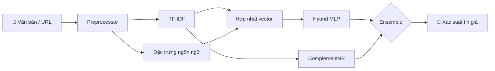

<div align="center">

# 🇻🇳 VN-FakeChat

**Ứng dụng phát hiện tin giả tiếng Việt — TF-IDF + đặc trưng ngôn ngữ + Hybrid MLP + Naive Bayes**

🔗 **Repository:** [github.com/NguyenPhong2912/NaviebayesxTFIDF](https://github.com/NguyenPhong2912/NaviebayesxTFIDF)

[](https://github.com/NguyenPhong2912/NaviebayesxTFIDF/actions/workflows/ci.yml)
[](https://github.com/NguyenPhong2912/NaviebayesxTFIDF/stargazers)
[](https://github.com/NguyenPhong2912/NaviebayesxTFIDF/network/members)
[](https://github.com/NguyenPhong2912/NaviebayesxTFIDF/commits)
[](https://github.com/NguyenPhong2912/NaviebayesxTFIDF)
[](https://github.com/NguyenPhong2912/NaviebayesxTFIDF/issues)

[](https://www.python.org/)
[](https://pytorch.org/)
[](https://scikit-learn.org/)
[](https://github.com/TomSchimansky/CustomTkinter)

</div>

<!-- Badge "Visitors" (hits.seeyoufarm.com) đã bỏ: domain thường lỗi DNS/bị chặn (NXDOMAIN). Lượt xem repo xem tại GitHub → Insights → Traffic (chỉ chủ repo). -->

---

## 📌 Mục lục

- [Tổng quan](#-tổng-quan)
- [Tính năng](#-tính-năng)
- [Kiến trúc](#-kiến-trúc)
- [Cài đặt](#-cài-đặt)
- [Huấn luyện mô hình](#-huấn-luyện-mô-hình)
- [Chạy ứng dụng](#-chạy-ứng-dụng)
- [Đánh giá nhanh](#-đánh-giá-nhanh)
- [Cấu trúc thư mục](#-cấu-trúc-thư-mục)
- [Dataset](#-dataset)
- [Đẩy code lên GitHub](#-đẩy-code-lên-github-một-lần)
- [Giấy phép](#-giấy-phép)

---

## 🎯 Tổng quan

**VN-FakeChat** là đồ án / ứng dụng desktop giúp người dùng **dán văn bản hoặc gửi URL bài báo** để nhận **xác suất tin giả** (tiếng Việt). Pipeline học máy kết hợp:

| Thành phần | Vai trò |
|------------|---------|
| 📝 **Tiền xử lý** | `underthesea` — chuẩn hóa, tách từ, bỏ stopwords |
| 🔢 **TF-IDF** | N-gram (1–2), từ vựng học trên **tập train** |
| 🧠 **Đặc trưng ngôn ngữ** | Từ kích động, nguồn mơ hồ, dấu cảm thán, v.v. (chuẩn hóa `StandardScaler`) |
| ⚡ **Hybrid MLP** | PyTorch + BatchNorm + Dropout |
| 📊 **ComplementNB** | Baseline trên TF-IDF |
| 🔗 **Ensemble** | Trung bình xác suất MLP + NB |

> **Lưu ý:** Đây là mô hình **đặc trưng cổ điển + neural nhỏ**, không phải fine-tune BERT/PhoBERT.

---

## ✨ Tính năng

- 🤖 **Chat UI** (CustomTkinter): intent chào hỏi, hướng dẫn, phân tích URL, hỏi đáp về bài đã tải.
- 🔗 **Trích nội dung từ URL** (`newspaper3k` + xử lý lỗi).
- 📈 **Huấn luyện có kiểm soát**: chia tập trước augmentation, tránh rò rỉ từ vựng / bản sao vào test.
- ⚙️ **Cấu hình** `config/config.yaml` (ngưỡng tin giả, tham số `training`).

<details>
<summary><b>🎨 Giao diện (mô tả ngắn)</b></summary>

- Dark theme, accent cyan / pink / green.
- Bong bóng tin nhắn, typing indicator, nút neon.

</details>

---

## 🏗 Kiến trúc



---

## 📦 Cài đặt

### Yêu cầu

- Python **3.10+**
- Windows / Linux / macOS (GUI dùng Tk)

### Clone & môi trường

```bash
git clone https://github.com/NguyenPhong2912/NaviebayesxTFIDF.git
cd NaviebayesxTFIDF
python -m venv .venv

# Windows
.venv\Scripts\activate

# Linux / macOS
source .venv/bin/activate

pip install -r build/requirements.txt
```

> Nếu chưa có file `.pkl` / `.pth` trong `models/`, cần **huấn luyện** (mục dưới) trước khi mở GUI.

<details>
<summary><b>🔧 Gợi ý PyTorch (CUDA)</b></summary>

Cài bản wheel phù hợp GPU tại [pytorch.org](https://pytorch.org/get-started/locally/). CPU-only vẫn chạy được huấn luyện / inference.

</details>

---

## 🧪 Huấn luyện mô hình

Đặt dữ liệu gốc (VFND, CSV, …) dưới `data/raw/` và synthetic (nếu có) dưới `data/synthetic/`, rồi:

```bash
python -m src.ml.train_model
```

Kết quả: `models/tfidf_vectorizer.pkl`, `complement_nb.pkl`, `feature_scaler.pkl`, `hybrid_mlp.pth`, biểu đồ confusion matrix / loss.

Tham số huấn luyện chỉnh trong `config/config.yaml` → khối `training:`.

---

## 🚀 Chạy ứng dụng

```bash
python src/main.py
# hoặc bật log chi tiết
python src/main.py --debug
```

---

## 📊 Đánh giá nhanh (synthetic)

```bash
python -m src.ml.eval_synthetic
```

Dùng để **smoke test** sau train; báo cáo chính thức nên dựa trên **tập test** do `train_model` in ra và/hoặc dữ liệu hold-out riêng.

---

## 📁 Cấu trúc thư mục

```
NaviebayesxTFIDF/
├── config/           # config.yaml
├── data/
│   ├── raw/          # VFND & dữ liệu gốc (không commit nếu quá lớn)
│   └── synthetic/    # Mẫu fake/real minh họa
├── models/           # Artefact sau train (.pkl, .pth)
├── src/
│   ├── main.py       # Entry GUI
│   ├── core/         # preprocessor, model_handler, article_analyzer
│   ├── gui/          # CustomTkinter app
│   ├── ml/           # train_model, eval_synthetic
│   └── utils/
├── build/requirements.txt
└── README.md
```

---

## 📚 Dataset

- **VFND** — [Vietnamese Fake News Dataset](https://github.com/thanhhocse96/vfnd-vietnamese-fake-news-datasets) (đặt trong `data/raw/` theo hướng dẫn riêng của bạn).
- **Synthetic** — file JSON trong `data/synthetic/` (phục vụ demo / cân lớp).

---

## 🔄 Đẩy code lên GitHub (một lần)

Từ thư mục dự án trên máy (sau khi đã có mã nguồn đầy đủ):

```bash
git init
git remote add origin https://github.com/NguyenPhong2912/NaviebayesxTFIDF.git
git branch -M main
git add .
git commit -m "feat: VN-FakeChat — TF-IDF, MLP, NB, GUI"
git push -u origin main
```

Nếu repo GitHub đã có commit README sẵn: `git pull origin main --rebase` rồi `git push`.

Mỗi lần `git push` lên nhánh `main`, **GitHub Actions** (`.github/workflows/ci.yml`) tự chạy kiểm tra cài đặt và import mã nguồn.

---

## 📜 Giấy phép

Thêm file `LICENSE` phù hợp (MIT, Apache-2.0, …) và cập nhật badge nếu cần:

```markdown
[](LICENSE)
```

---

<div align="center">

**⭐ Nếu repo hữu ích, hãy star để badge phía trên cập nhật số sao trên GitHub.**

Made with ❤️ for Vietnamese NLP / media literacy

</div>
